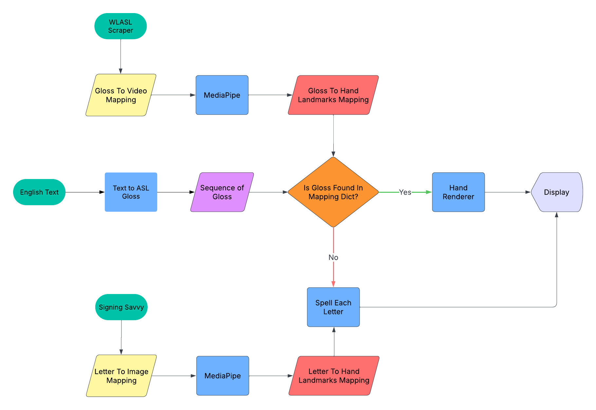

# English To ASL Renderer

## Team Member: 
Dizhou Zhang, Jaden Wang, Hua-Yuan Chum Yashwanth Devabathini

Sign languages are the primary mode of communication for millions of Deaf and hard-of-hearing individuals worldwide. However, a significant communication barrier exists between sign language users and those who rely on spoken or written languages, as most people are not fluent in sign language. While technologies like speech-to-text transcription have improved accessibility, they do not fully bridge the gap, as text-based solutions lack the expressiveness and grammar structure of sign languages. A real-time speech/text-to-sign language conversion system could enable more inclusive communication by instantly translating spoken or written language into animated sign language gestures. Existing solutions are often limited by high computational costs, reliance on cloud-based processing, or the lack of real-time capabilities. By leveraging lightweight NLP models and TinyML-based optimization, we aim to develop a reliable, real-time, and mobile-friendly solution that enhances accessibility for Deaf communities in everyday interactions.

## Overview

An American Sign Language translation and rendering pipeline. 



## Features 🌟

* **English Text Input:** Simple interface to enter English sentences or phrases.
* **ASL Gloss Translation:** Leverages a fine-tuned T5 model to translate English into a suitable ASL representation (e.g., gloss).
* **Gesture Rendering:** Visualizes the translated ASL using MediaPipe Hand landmarks for realistic hand shapes and movements.
* **Interactive Learning:** Provides a visual aid for understanding how English concepts map to ASL signs.

## How It Works ⚙️

This project combines natural language processing with computer vision techniques:

1.  **Frontend (WebView):** A clean web interface allows users to input English text.
2.  **Backend (Flask):** The Flask server receives the text input from the frontend.
3.  **Translation (Fine-tuned T5):** The input text is passed to a fine-tuned T5 model specialized for English-to-ASL gloss translation.
4.  **Gesture Logic (Backend):** The backend interprets the generated ASL gloss and calculates the corresponding sequence of hand poses and movements.
5.  **Rendering (WebView + MediaPipe):** The pose sequence data is sent back to the frontend. The WebView interface uses this data, leveraging MediaPipe's visualization utilities to display the animated ASL hand gestures.

## Tech Stack 🔧

* **Machine Translation:** Fine-tuned `T5` model
* **Backend Framework:** `Flask`
* **Frontend Interface:** `WebView`
* **Hand Tracking/Rendering:** `MediaPipe Hands`

## Getting Started 🚀

Follow these steps to get the project running locally.

### Prerequisites

* Python 3.8+ and Pip
* install "requirements.txt"

### Installation

1.  **Clone the repository:**

2.  **Set up Python environment (Recommended):**

3.  **Install dependencies:**
    ```bash
    pip install -r requirements.txt
    ```
4.  **Download model from this link: https://www.dropbox.com/scl/fo/35g0b131765pte1b5rowi/AAmkHVrfDmpOQQ_6cp7D0Pk?rlkey=hcliy2jamdlb8kqfuozedya2y&st=wuxkb0al&dl=0**

5.  **Drop the fine-tuned T5 model in the root folder:**

### Running the Application

```bash
    python app.py
```


### Adding a New Gloss

Our program allows user to add additional glosses if anything is missing. 

You will need a video showing the sign, and the corresponding gloss.

For example, suppose I have "123123.mp4", which is a video showcasing the gloss "Apple", run:

```bash
    python main.py --gloss "Apple" --video_path "123123.mp4" --video_id "123123" --action "parse_video"
```

After running this line, check "gloss_to_gesture_mapping_condensed.csv" to see if newest entry is added.

!!! Important: 
Don't add duplicate gloss, at the moment it may break the application unless the gloss gesture mapping is reset.


### Easier Setup:

I've included a .exe file for Windows users if set up is too complicated.

First time running the executable may be slow since it will attempt to install all dependencies.


## Acknowledgements 🙏

* Google's [MediaPipe](https://developers.google.com/mediapipe) team for the hand tracking toolkit.
* The Hugging Face team for the `transformers` library and T5 model access.